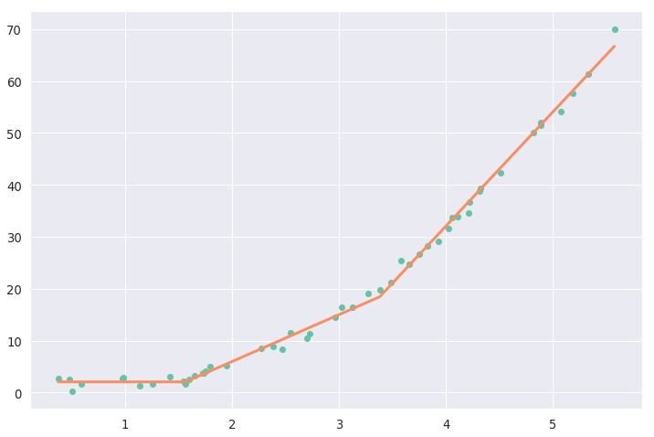

# About
PWLFit is a small library to fit data with a piecewise linear function.

This is not an officially supported Google product.

# Example usage:

## Fitting a two-segment line

```python
import numpy as np
from pwlfit import fitter
from pwlfit import utils

# Generate a somewhat noisy data to fit:
xs = np.arange(0, 5, 0.05)
xs += np.random.normal(size=len(xs))
xs = np.sort(xs)
ys = 3 * np.power(xs - 1, 2) + xs - 1
ys += np.random.normal(scale=3, size=len(xs))

# Fit and evaluate.
curve = fitter.fit_pwl(xs, ys, num_segments=2)
print(curve)
print('MSE: ', np.sum((ys - curve.eval(xs)) **2.0) / len(ys))
```



## Fitting a non-monotonic two-segment line.

```python
xs = np.arange(100)
ys = np.concatenate((np.arange(50), np.arange(50, 0, -1)))
curve = fitter.fit_pwl(xs, ys, num_segments=2, mono=False)
print(curve)
print('MSE: ', np.sum((ys - curve.eval(xs)) **2.0) / len(ys))
```
